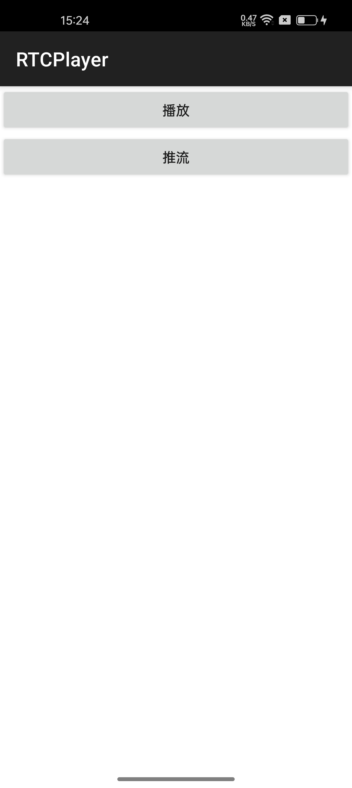
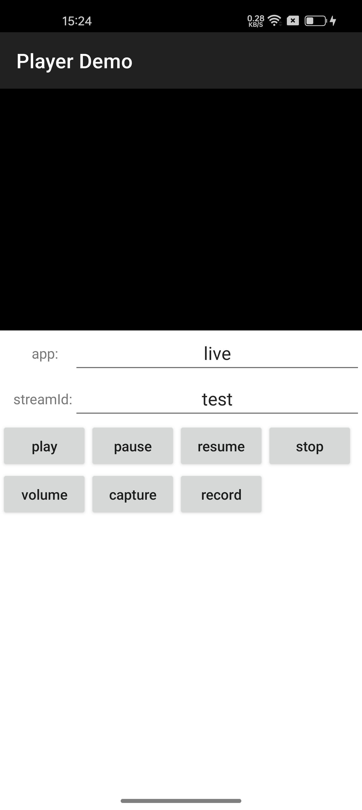
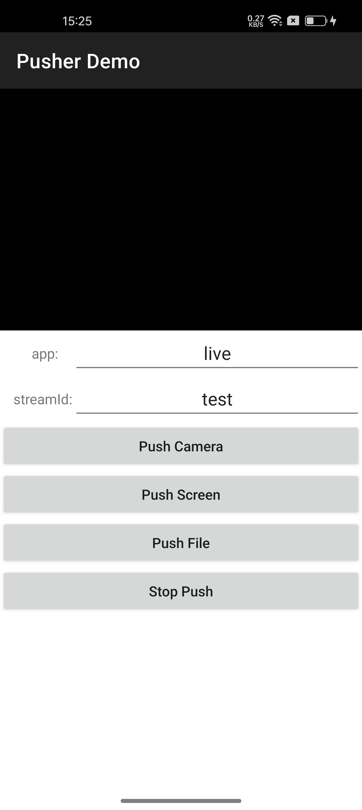
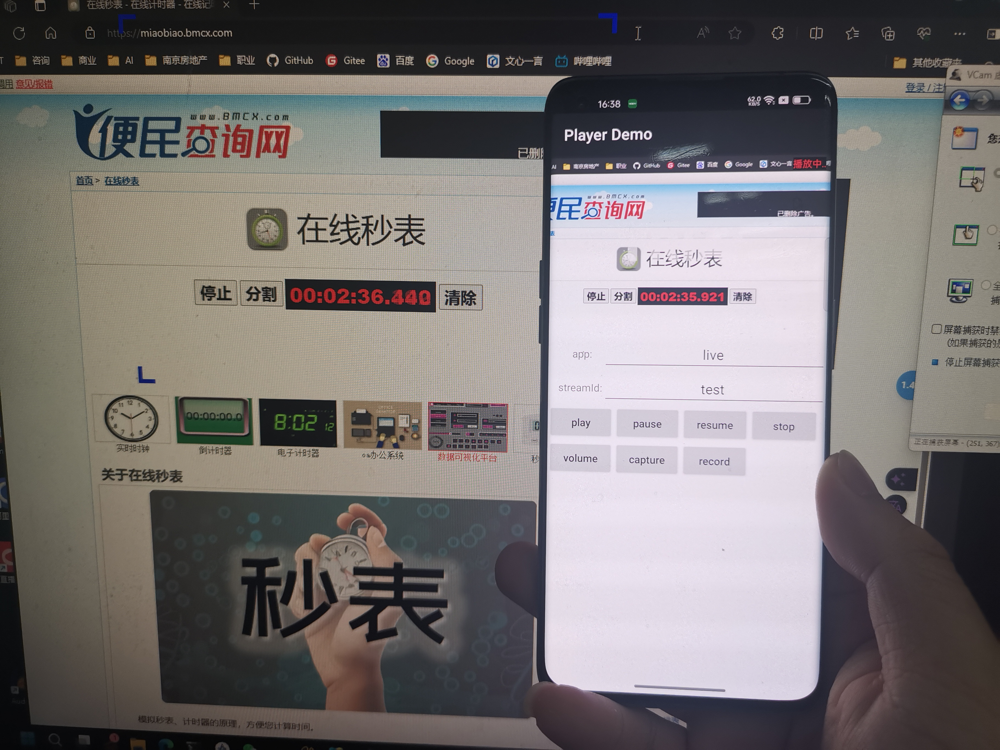
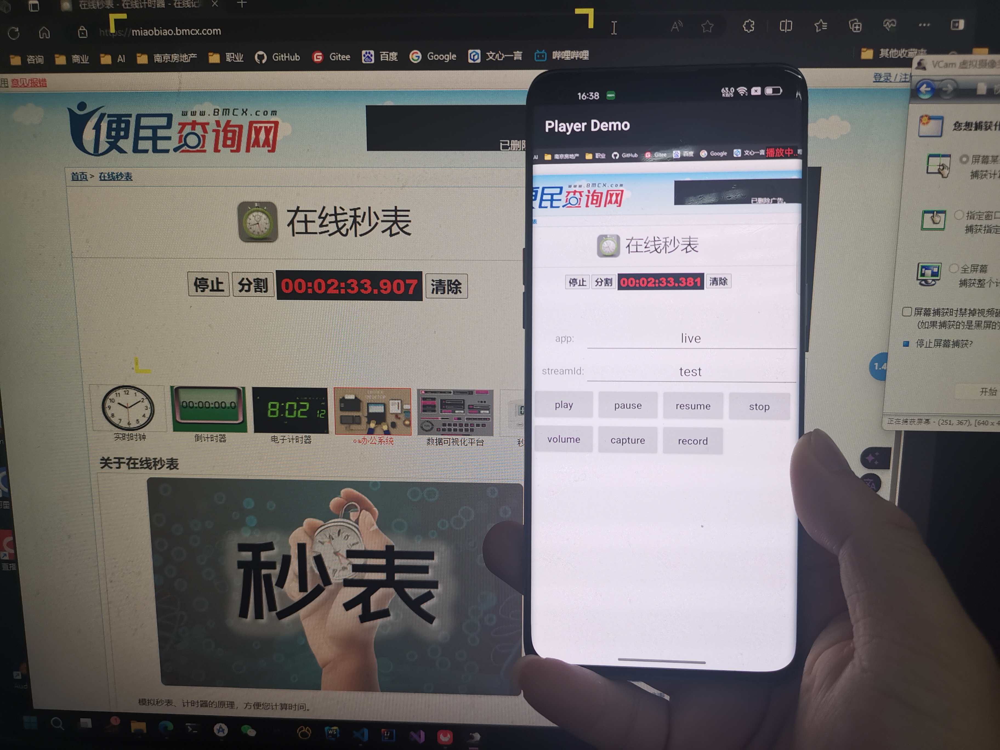
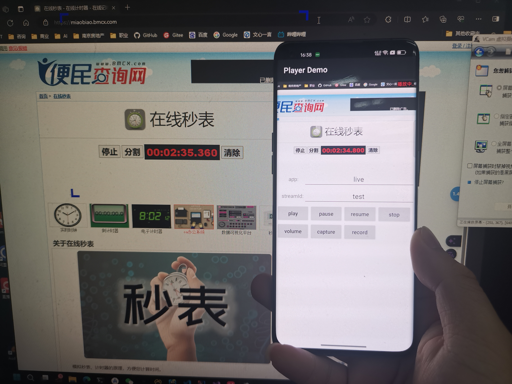

# RTCPlayer 播放器

一个基于Android客户端的的RTC播放器

## 项目特点

  - 低延迟
  - [X]支持[ZLMediakit](https://github.com/ZLMediaKit/ZLMediaKit)流媒体
  - [ ]支持[SRS](https://github.com/ossrs/srs)
  - [ ]支持[Janus](https://github.com/meetecho/janus-gateway)

    &nbsp;&nbsp;&nbsp;
    &nbsp;&nbsp;&nbsp;
    

## 延迟情况

- **网页端推流，Android端播放**

    &nbsp;&nbsp;&nbsp;
    &nbsp;&nbsp;&nbsp;
    

三次延迟分别为：490ms、526ms、560ms

- **Android端推屏幕流，网页端播放**

    &nbsp;&nbsp;&nbsp;
    &nbsp;&nbsp;&nbsp;
    

三次延迟分别为：440ms、430ms、387ms

## 接口说明

### Player

- bind(surface: RTCSurfaceView)

  绑定视图

- play(app: String, streamId: String)

  播放
- setVolume(volume:Float)

  设置音量，范围: 0.0~1.0f
- stop()

  停止播放
- pause()

  暂停播放
- resume()

  恢复播放
- capture(listener: (bitmap: Bitmap) -> Unit)

  截图
- record(duration: Long, result: (path: String) -> Unit)

  录制
- setOnErrorListener(listener: (code: Int, msg: String) -> Unit)
  
  设置播放器错误监听回调
- setOnStatusListener(listener: (status: Status) -> Unit)

  设置播放器状态回调

### Pusher

- bind(surface: RTCSurfaceView, localPreview: Boolean)

  绑定视图

- push(app: String, streamId: String, mode: PushMode = PushMode.CAMERA, inputFile: String = "")

  推流，支持Camera、Screen、File

- stop()
  
  停止推流

- setOnErrorListener(listener: (code: Int, msg: String) -> Unit)

  设置播放器错误监听回调

## 联系作者
如果您需要深度二次开发，并支持其他流媒体服务，可以找我哦！
[李之阳](https://github.com/leo94666)

## 特别感谢

感谢[ZLMediakit](https://github.com/ZLMediaKit/ZLMediaKit)开源项目

同时感谢JetBrains对开源项目的支持，本项目使用Android Studio开发与调试：

